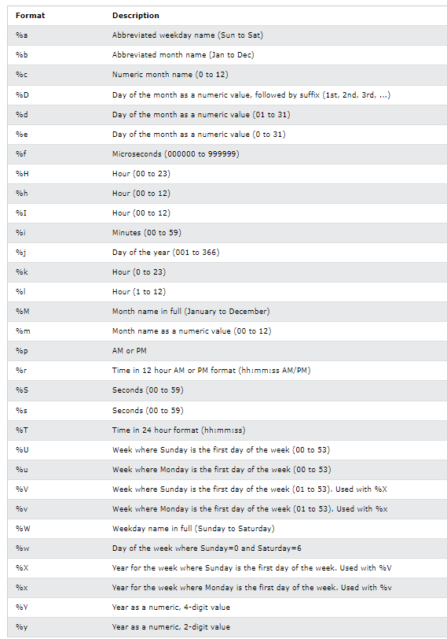

# SQL Review

- [Basic Format](#basic-format)
- [SQL Funtion](#sql-function-mainly-used)
- [Date Function](#date-function-mainly-used)
- [CTE](#cte)
- [Window Function](#window-function)

## Basic Format

<pre>
            <strong>Select</strong>   xxx (Col) -> [as rename / allow function]
            <strong>From</strong>     xxx (Table)
           [<strong>Join</strong>     xxx (Table) <strong>using</strong> (xxx (Col)) / <strong>on</strong> a = b (or a <> b)]
            <strong>Where</strong>    xxx (Condition) -> [is (not) null; (not) in; <>; etc] / ['and'; 'or']
            <strong>Group By</strong> xxx (Col)
            <strong>Having</strong>   xxx (Condition) -> [count(~) > 0; etc]
            <strong>Order By</strong> xxx (Col) -> [desc]

</pre>

### &nbsp;&nbsp; SQL Query Order of Execution

1. &nbsp;&nbsp;&nbsp;&nbsp; **From**
2. &nbsp;&nbsp;&nbsp;&nbsp; **Join**
3. &nbsp;&nbsp;&nbsp;&nbsp; **Where**
4. &nbsp;&nbsp;&nbsp;&nbsp; **Group By**
5. &nbsp;&nbsp;&nbsp;&nbsp; **Having**
6. &nbsp;&nbsp;&nbsp;&nbsp; **Select**
7. &nbsp;&nbsp;&nbsp;&nbsp; **Distinct**
8. &nbsp;&nbsp;&nbsp;&nbsp; **Order By**
9. &nbsp;&nbsp;&nbsp;&nbsp; **Limit & Offset**

## SQL Function (Mainly used)

Full version on: https://www.w3schools.com/sql/sql_ref_sqlserver.asp

<ul>
  <li>If (condition, <em>a</em>, <em>b</em>) - where <em>a</em> is the output if condition is <span style = 'color:red;'>True</span>, <em>b</em> is the output if condition is <span style = 'color:red;'>False</span></li>
  <li>Concat (<em>a</em>, <em>b</em>, *args) - where <em>a</em> and <em>b</em> are string</li>
  <li>Substring (value, <em>a</em>, <em>b</em>) - where <em>a</em> is the index of starting character, <em>b</em> is the length of substring</li>
  <li>Case
    <ul style="list-style-type:none; margin-top:0; padding-top:0;">
      <li>When condition Then result</li>
      <li>Else</li>
    </ul>
  </li>
  <li style="list-style-type:none;">End</li>
</ul>

## Date Function (Mainly used)

Time: Unit in Hour of Second.

Date: Unit in Day

- Date_format(*time*, *format*)



- Datediff(*time1*, *time2*) -> time1 - time2

- Date_add(*time*, INTERVAL *value* *addunit*) -> add exact day/hour/... and return the date, value could be negative

- Day(*time*) / Dayname(*time*) / Dayofmonth(*time*) / Dayofweek(*time*) / Dayofyear(*time*) -> return the day of date

- Month(*time*) / Week(*time*) / Year(*time*) -> return the month/... of the date

- Condition -> *time* <span style = 'color:blue;'>between</span> 'YYYY-MM-DD' <span style = 'color:blue;'>and</span> 'YYYY-MM-DD'

## CTE

&nbsp;&nbsp;&nbsp;&nbsp; Common Table Expression (CTE) is a temporary result set. (Advanced Usage -> Recursive)

```sql
With name1 as (
  query
),
name2 as (
  query
)
select xxx
```

&nbsp;&nbsp;&nbsp;&nbsp; Recursive CTE, including two parts

- &nbsp;&nbsp;&nbsp;&nbsp; Anchor Member (Initial)

- &nbsp;&nbsp;&nbsp;&nbsp; Recursive Member (Based on Anchor Member)

- &nbsp;&nbsp;&nbsp;&nbsp; Union All -> connect two parts

**Example:**

```sql
with Recursive CTE as(
  -- Anchor member
  select xxx, 0 as level
  ...
  -- End of Anchor, Union all to connect
  union all
  -- Recursive member
  select xxx, c.level + 1
  from TableX Inner Join CTE c using (id)
)
```

## Window Function

&nbsp;&nbsp;&nbsp;&nbsp; Perform calculation across a set of table rows that related to the current row

&nbsp;&nbsp;&nbsp;&nbsp; Window function consist:

- &nbsp;&nbsp;&nbsp;&nbsp; Function itself: (Row_number(); Rank(); Sum(); etc)

- &nbsp;&nbsp;&nbsp;&nbsp; 'Over' clause, define the window or set of rows for functions

```sql
Function_name() Over(Partition By xxx Order By xxx) as New_name
```

- Row_number(): Assigns a unique sequential integer to each row

- Rank(): Assigns a rank to each row

- Dense_rank(): Similar to Rank(), but without gaps in rank values for ties

- Lag(Col, *a*, *b*): Previous *a* row's data, autofill *b* at beginning

**Example**

| SalesPersonID | SaleDate   | Amount | RowNum | Rank | DenseRank | CumulativeSum | RunningAvg | Lag |
|---------------|------------|--------|--------|------|-----------|---------------|------------|-----|
| 1             | 2023-01-01 | 100    | 1      | 3    | 3         | 100           | 100        |  0  |
| 1             | 2023-02-01 | 200    | 2      | 1    | 1         | 300           | 150        | 100 |
| 1             | 2023-03-01 | 150    | 3      | 2    | 2         | 450           | 150        | 200 |
| 2             | 2023-01-15 | 300    | 1      | 1    | 1         | 300           | 300        | 150 |
| 2             | 2023-02-15 | 100    | 2      | 2    | 2         | 400           | 200        | 300 |

## Example Question

- [Using Like %%](#customers-who-bought-products-a-and-b-but-not-c)

- [Condition Double In](#highest-grade-for-each-student)

- [Case When](#evaluate-boolean-expression)

- [Case When Ifnull](#team-scores-in-football-tournament)

- [Lag](#apples--oranges)

- [Multi-subquery](#contries-you-can-safely-invest-in)

- [Union](#page-recommendations)

- [Join not Equal](#game-play-analysis-iii)

- [Self Join](#leetflex-banned-accounts)

- [Highest By Rank](#department-highest-salary)

- [Row Number](#find-the-start-and-end-number-of-continuous-ranges)

- [Time Diff Lag](#biggest-window-between-visits)

- [Row Num - Row Num](#report-contiguous-dates)

- [Recursive CTE](#find-the-subtasks-that-did-not-execute)

### Customers Who Bought Products A and B but Not C

**Table: Customers**

| Column Name    | Type    |
|----------------|---------|
| customer_id    | int     |
| customer_name  | varchar |

- `customer_id` is the column with unique values for this table.
- `customer_name` is the name of the customer.

**Table: Orders**

| Column Name   | Type    |
|---------------|---------|
| order_id      | int     |
| customer_id   | int     |
| product_name  | varchar |

- `order_id` is the column with unique values for this table.
- `customer_id` is the id of the customer who bought the product `product_name`.

**Task Description**

Write a solution to report the `customer_id` and `customer_name` of customers who bought products "A" and "B" but did not buy the product "C" since we want to recommend them to purchase this product.

Return the result table ordered by `customer_id`.

**Input:**

**Customers table:**

| customer_id | customer_name |
|-------------|---------------|
| 1           | Daniel        |
| 2           | Diana         |
| 3           | Elizabeth     |
| 4           | Jhon          |

**Orders table:**

| order_id | customer_id | product_name |
|----------|-------------|--------------|
| 10       | 1           | A            |
| 20       | 1           | B            |
| 30       | 1           | D            |
| 40       | 1           | C            |
| 50       | 2           | A            |
| 60       | 3           | A            |
| 70       | 3           | B            |
| 80       | 3           | D            |
| 90       | 4           | C            |

**Output**

| customer_id | customer_name |
|-------------|---------------|
| 3           | Elizabeth     |

**Answer**
```sql
WITH cte AS (
    SELECT
        customer_id,
        GROUP_CONCAT(product_name ORDER BY product_name SEPARATOR "") concat_name
    FROM
        Orders
    GROUP BY 
        1
    HAVING
        concat_name LIKE "%AB%" 
    AND 
        concat_name NOT LIKE "%C%"
)
SELECT 
    cust.*
FROM 
    cte 
INNER JOIN
    Customers cust
USING
    (customer_id)
ORDER BY 
    1
```
**or**
```sql
with join_table as (
  select *
    from Customers c
    left join Orders o
    using (customer_id)  
),
pro_A as (
    select distinct customer_id
    from join_table
    where product_name = 'A'
),
pro_B as (
    select distinct customer_id
    from join_table
    where product_name = 'B'
),
pro_C as (
    select distinct customer_id
    from join_table
    where product_name = 'C'
)
select customer_id, customer_name
from Customers
where customer_id in (select * from pro_A) 
and customer_id in (select * from pro_B)
and customer_id not in (select * from pro_C)
```

### Highest Grade For Each Student

**Table: Enrollments**

| Column Name   | Type    |
|---------------|---------|
| student_id    | int     |
| course_id     | int     |
| grade         | int     |

(student_id, course_id) is the primary key (combination of columns with unique values) of this table.
grade is never NULL.

**Task Description**

Write a solution to find the highest grade with its corresponding course for each student. In case of a tie, you should find the course with the smallest course_id.

Return the result table ordered by student_id in ascending order.

The result format is in the following example.

**Example 1:**

**Input:**

Enrollments table:

| student_id | course_id | grade |
|------------|-----------|-------|
| 2          | 2         | 95    |
| 2          | 3         | 95    |
| 1          | 1         | 90    |
| 1          | 2         | 99    |
| 3          | 1         | 80    |
| 3          | 2         | 75    |
| 3          | 3         | 82    |

**Output:**

| student_id | course_id | grade |
|------------|-----------|-------|
| 1          | 2         | 99    |
| 2          | 2         | 95    |
| 3          | 3         | 82    |

**Explanation:** For each student, the course with the highest grade is selected. In case of a tie in grades, the course with the smallest course_id is chosen. The result is ordered by student_id in ascending order.

```sql
SELECT student_id, MIN(course_id) AS course_id, grade
FROM Enrollments
WHERE (student_id, grade) IN
(
    SELECT student_id, MAX(grade)
    FROM Enrollments
    GROUP BY student_id
)
GROUP BY student_id
ORDER BY student_id ASC
```

### Evaluate Boolean Expression

**Table: Variables**

| Column Name | Type    |
|-------------|---------|
| name        | varchar |
| value       | int     |

In SQL, `name` is the primary key for this table.
This table contains the stored variables and their values.

**Table: Expressions**

| Column Name   | Type    |
|---------------|---------|
| left_operand  | varchar |
| operator      | enum    |
| right_operand | varchar |

In SQL, `(left_operand, operator, right_operand)` is the primary key for this table.
This table contains a boolean expression that should be evaluated.
`operator` is an enum that takes one of the values ('<', '>', '=')
The values of `left_operand` and `right_operand` are guaranteed to be in the Variables table.

**Task Description**

Evaluate the boolean expressions in the Expressions table.

Return the result table in any order.

The result format is in the following example.

**Example 1:**

**Input:**

Variables table:

| name | value |
|------|-------|
| x    | 66    |
| y    | 77    |

Expressions table:

| left_operand | operator | right_operand |
|--------------|----------|---------------|
| x            | >        | y             |
| x            | <        | y             |
| x            | =        | y             |
| y            | >        | x             |
| y            | <        | x             |
| x            | =        | x             |

**Output:**

| left_operand | operator | right_operand | value |
|--------------|----------|---------------|-------|
| x            | >        | y             | false |
| x            | <        | y             | true  |
| x            | =        | y             | false |
| y            | >        | x             | true  |
| y            | <        | x             | false |
| x            | =        | x             | true  |

**Explanation:** As shown, you need to find the value of each boolean expression in the table using the Variables table.

```sql
select e.left_operand, e.operator, e.right_operand, (
    case
        when e.operator = '<' and v1.value < v2.value then 'true'
        when e.operator = '=' and v1.value = v2.value then 'true'
        when e.operator = '>' and v1.value > v2.value then 'true'
        else 'false'
    end
) as value  
from Expressions e
join Variables v1
on v1.name = e.left_operand
join Variables v2
on v2.name = e.right_operand
```

### Team Scores in Football Tournament

**Table: Teams**

| Column Name | Type    |
|-------------|---------|
| team_id     | int     |
| team_name   | varchar |

`team_id` is the column with unique values of this table.
Each row of this table represents a single football team.

**Table: Matches**

| Column Name | Type    |
|-------------|---------|
| match_id    | int     |
| host_team   | int     |
| guest_team  | int     |
| host_goals  | int     |
| guest_goals | int     |

`match_id` is the column with unique values of this table.
Each row is a record of a finished match between two different teams.
Teams `host_team` and `guest_team` are represented by their IDs in the Teams table (`team_id`), and they scored `host_goals` and `guest_goals` goals, respectively.

**Task Description**

You would like to compute the scores of all teams after all matches. Points are awarded as follows:
- A team receives three points if they win a match (i.e., scored more goals than the opponent team).
- A team receives one point if they draw a match (i.e., scored the same number of goals as the opponent team).
- A team receives no points if they lose a match (i.e., scored fewer goals than the opponent team).

Write a solution that selects the `team_id`, `team_name` and `num_points` of each team in the tournament after all described matches.

Return the result table ordered by `num_points` in decreasing order. In case of a tie, order the records by `team_id` in increasing order.

The result format is in the following example.

**Example 1:**

**Input:**

Teams table:

| team_id | team_name   |
|---------|-------------|
| 10      | Leetcode FC |
| 20      | NewYork FC  |
| 30      | Atlanta FC  |
| 40      | Chicago FC  |
| 50      | Toronto FC  |

Matches table:

| match_id | host_team | guest_team | host_goals | guest_goals |
|----------|-----------|------------|------------|-------------|
| 1        | 10        | 20         | 3          | 0           |
| 2        | 30        | 10         | 2          | 2           |
| 3        | 10        | 50         | 5          | 1           |
| 4        | 20        | 30         | 1          | 0           |
| 5        | 50        | 30         | 1          | 0           |

**Output:**

| team_id | team_name   | num_points |
|---------|-------------|------------|
| 10      | Leetcode FC | 7          |
| 20      | NewYork FC  | 3          |
| 50      | Toronto FC  | 3          |
| 30      | Atlanta FC  | 1          |
| 40      | Chicago FC  | 0          |

**Explanation:** For each team, compute the total points based on the results of their matches. The result table is ordered by `num_points` in decreasing order. In case of a tie, the records are ordered by `team_id` in increasing order.

```sql
with ctd1 as (
    select host_team as team_id, (
        case
            when host_goals > guest_goals then 3
            when host_goals = guest_goals then 1
            else 0
        end
    ) as points
    from Matches m
    join Teams t
    on m.host_team = t.team_id
    union all
    select guest_team as team_id, (
        case
            when host_goals > guest_goals then 0
            when host_goals = guest_goals then 1
            else 3
        end
    ) as points
    from Matches m
    join Teams t
    on m.guest_team = t.team_id

)

select t.team_id, team_name, ifnull(sum(points),0) as num_points
from Teams t
left join ctd1 c
using (team_id)
group by t.team_id
order by num_points desc, t.team_id 
```

### Apples & Oranges

**Table: Sales**

| Column Name | Type |
|-------------|------|
| sale_date   | date |
| fruit       | enum |
| sold_num    | int  |

(sale_date, fruit) is the primary key (combination of columns with unique values) of this table.
This table contains the sales of "apples" and "oranges" sold each day.

**Task Description**

Write a solution to report the difference between the number of apples and oranges sold each day.

Return the result table ordered by sale_date.

The result format is in the following example.

**Example 1:**

**Input:**

Sales table:

| sale_date  | fruit   | sold_num |
|------------|---------|----------|
| 2020-05-01 | apples  | 10       |
| 2020-05-01 | oranges | 8        |
| 2020-05-02 | apples  | 15       |
| 2020-05-02 | oranges | 15       |
| 2020-05-03 | apples  | 20       |
| 2020-05-03 | oranges | 0        |
| 2020-05-04 | apples  | 15       |
| 2020-05-04 | oranges | 16       |

**Output:**

| sale_date  | diff |
|------------|------|
| 2020-05-01 | 2    |
| 2020-05-02 | 0    |
| 2020-05-03 | 20   |
| 2020-05-04 | -1   |

**Explanation:** 
Day 2020-05-01, 10 apples and 8 oranges were sold (Difference 10 - 8 = 2).
Day 2020-05-02, 15 apples and 15 oranges were sold (Difference 15 - 15 = 0).
Day 2020-05-03, 20 apples and 0 oranges were sold (Difference 20 - 0 = 20).
Day 2020-05-04, 15 apples and 16 oranges were sold (Difference 15 - 16 = -1).

```sql
with cte1 as (
    select sale_date, fruit, sold_num, lag(sold_num, 1, 0) over(partition by sale_date order by fruit) as sold_num_a
    from Sales
    
)
select sale_date, sold_num_a - sold_num as diff
from cte1
where sold_num_a > 0
order by sale_date
```

### Contries You Can Safely Invest In

**Table: Person**

| Column Name  | Type    |
|--------------|---------|
| id           | int     |
| name         | varchar |
| phone_number | varchar |

`id` is the column of unique values for this table.
Each row of this table contains the name of a person and their phone number.
Phone number will be in the form 'xxx-yyyyyyy' where `xxx` is the country code (3 characters) and `yyyyyyy` is the phone number (7 characters) where `x` and `y` are digits. Both can contain leading zeros.

**Table: Country**

| Column Name  | Type    |
|--------------|---------|
| name         | varchar |
| country_code | varchar |

`country_code` is the column of unique values for this table.
Each row of this table contains the country name and its code. `country_code` will be in the form 'xxx' where `x` is digits.

**Table: Calls**

| Column Name | Type |
|-------------|------|
| caller_id   | int  |
| callee_id   | int  |
| duration    | int  |

This table may contain duplicate rows.
Each row of this table contains the caller id, callee id and the duration of the call in minutes. `caller_id` != `callee_id`

**Task Description**

A telecommunications company wants to invest in new countries. The company intends to invest in the countries where the average call duration of the calls in this country is strictly greater than the global average call duration.

Write a solution to find the countries where this company can invest.

Return the result table in any order.

The result format is in the following example.

**Example 1:**

**Input:**

Person table:

| id | name     | phone_number |
|----|----------|--------------|
| 3  | Jonathan | 051-1234567  |
| 12 | Elvis    | 051-7654321  |
| 1  | Moncef   | 212-1234567  |
| 2  | Maroua   | 212-6523651  |
| 7  | Meir     | 972-1234567  |
| 9  | Rachel   | 972-0011100  |

Country table:

| name     | country_code |
|----------|--------------|
| Peru     | 051          |
| Israel   | 972          |
| Morocco  | 212          |
| Germany  | 049          |
| Ethiopia | 251          |

Calls table:

| caller_id | callee_id | duration |
|-----------|-----------|----------|
| 1         | 9         | 33       |
| 2         | 9         | 4        |
| 1         | 2         | 59       |
| 3         | 12        | 102      |
| 3         | 12        | 330      |
| 12        | 3         | 5        |
| 7         | 9         | 13       |
| 7         | 1         | 3        |
| 9         | 7         | 1        |
| 1         | 7         | 7        |

**Output:**

| country  |
|----------|
| Peru     |

**Explanation:** 
The average call duration for Peru is (102 + 330 + 5) / 3 = 145.666667
The average call duration for Israel is (33 + 4 + 13 + 3 + 1 + 1 + 7) / 7 = 9.428571
The average call duration for Morocco is (59 + 4) / 2 = 31.5 
Global call duration average = (33 + 4 + 59 + 102 + 330 + 5 + 13 + 3 + 1 + 7) / 10 = 55.7
Since Peru is the only country where the average call duration is greater than the global average, it is the only recommended country.

```sql
with Person_c as (
    select id, substring(phone_number, 1, 3) as country_code
    from Person
),
caller as (
    select c.name, duration
    from Calls
    left join Person_c p
    on p.id = caller_id
    left join Country c
    using (country_code)
),
callee as (
    select c.name, duration
    from Calls
    left join Person_c p
    on p.id = callee_id
    left join Country c
    using (country_code)
),
summary as (
    select name as country, avg(duration) as total
    from (
        select *
        from caller
        union
        select *
        from callee
    ) as resource
    group by name
)
select country
from (
    summary
)
where total > (select avg(total) from summary)
order by total
```

### Page Recommendations

**Table: Friendship**

| Column Name | Type |
|-------------|------|
| user1_id    | int  |
| user2_id    | int  |

(user1_id, user2_id) is the primary key (combination of columns with unique values) for this table.
Each row of this table indicates that there is a friendship relation between `user1_id` and `user2_id`.

**Table: Likes**

| Column Name | Type |
|-------------|------|
| user_id     | int  |
| page_id     | int  |

(user_id, page_id) is the primary key (combination of columns with unique values) for this table.
Each row of this table indicates that `user_id` likes `page_id`.

**Task Description**

Write a solution to recommend pages to the user with `user_id = 1` using the pages that your friends liked. It should not recommend pages you already liked.

Return result table in any order without duplicates.

The result format is in the following example.

**Example 1:**

**Input:**

Friendship table:

| user1_id | user2_id |
|----------|----------|
| 1        | 2        |
| 1        | 3        |
| 1        | 4        |
| 2        | 3        |
| 2        | 4        |
| 2        | 5        |
| 6        | 1        |

Likes table:

| user_id | page_id |
|---------|---------|
| 1       | 88      |
| 2       | 23      |
| 3       | 24      |
| 4       | 56      |
| 5       | 11      |
| 6       | 33      |
| 2       | 77      |
| 3       | 77      |
| 6       | 88      |

**Output:**

| recommended_page |
|------------------|
| 23               |
| 24               |
| 56               |
| 33               |
| 77               |

**Explanation:** 
User one is friend with users 2, 3, 4 and 6.
Suggested pages are 23 from user 2, 24 from user 3, 56 from user 3 and 33 from user 6.
Page 77 is suggested from both user 2 and user 3.
Page 88 is not suggested because user 1 already likes it.

```sql
with friends as(
    select user1_id as id
    from Friendship
    where user2_id = 1
    union
    select user2_id as id
    from Friendship
    where user1_id = 1
)
select distinct page_id as recommended_page
from Likes
where user_id in (select id from friends)
    and page_id not in (select page_id from Likes where user_id = 1)
```

### Game Play Analysis III

**Table: Activity**

| Column Name  | Type |
|--------------|------|
| player_id    | int  |
| device_id    | int  |
| event_date   | date |
| games_played | int  |

(player_id, event_date) is the primary key (column with unique values) of this table.
This table shows the activity of players of some games.
Each row is a record of a player who logged in and played a number of games (possibly 0) before logging out on some day using some device.

**Task Description**

Write a solution to report for each player and date, how many games played so far by the player. That is, the total number of games played by the player until that date. Check the example for clarity.

Return the result table in any order.

The result format is in the following example.

**Example 1:**

**Input:**

Activity table:

| player_id | device_id | event_date | games_played |
|-----------|-----------|------------|--------------|
| 1         | 2         | 2016-03-01 | 5            |
| 1         | 2         | 2016-05-02 | 6            |
| 1         | 3         | 2017-06-25 | 1            |
| 3         | 1         | 2016-03-02 | 0            |
| 3         | 4         | 2018-07-03 | 5            |

**Output:**

| player_id | event_date | games_played_so_far |
|-----------|------------|---------------------|
| 1         | 2016-03-01 | 5                   |
| 1         | 2016-05-02 | 11                  |
| 1         | 2017-06-25 | 12                  |
| 3         | 2016-03-02 | 0                   |
| 3         | 2018-07-03 | 5                   |

**Explanation:** 
For the player with id 1, 5 + 6 = 11 games played by 2016-05-02, and 5 + 6 + 1 = 12 games played by 2017-06-25.
For the player with id 3, 0 + 5 = 5 games played by 2018-07-03.
Note that for each player we only care about the days when the player logged in.

```sql
select a1.player_id, a1.event_date, sum(a2.games_played) as games_played_so_far
from Activity a1
inner join Activity a2
on a1.event_date >= a2.event_date and a1.player_id = a2.player_id
group by a1.player_id, a1.event_date
```

### Leetflex Banned Accounts

**Table: LogInfo**

| Column Name | Type     |
|-------------|----------|
| account_id  | int      |
| ip_address  | int      |
| login       | datetime |
| logout      | datetime |

This table may contain duplicate rows.
The table contains information about the login and logout dates of Leetflex accounts. It also contains the IP address from which the account was logged in and out.
It is guaranteed that the logout time is after the login time.

**Task Description**

Write a solution to find the `account_id` of the accounts that should be banned from Leetflex. An account should be banned if it was logged in at some moment from two different IP addresses.

Return the result table in any order.

The result format is in the following example.

**Example 1:**

**Input:**

LogInfo table:

| account_id | ip_address | login               | logout              |
|------------|------------|---------------------|---------------------|
| 1          | 1          | 2021-02-01 09:00:00 | 2021-02-01 09:30:00 |
| 1          | 2          | 2021-02-01 08:00:00 | 2021-02-01 11:30:00 |
| 2          | 6          | 2021-02-01 20:30:00 | 2021-02-01 22:00:00 |
| 2          | 7          | 2021-02-02 20:30:00 | 2021-02-02 22:00:00 |
| 3          | 9          | 2021-02-01 16:00:00 | 2021-02-01 16:59:59 |
| 3          | 13         | 2021-02-01 17:00:00 | 2021-02-01 17:59:59 |
| 4          | 10         | 2021-02-01 16:00:00 | 2021-02-01 17:00:00 |
| 4          | 11         | 2021-02-01 17:00:00 | 2021-02-01 17:59:59 |

**Output:**

| account_id |
|------------|
| 1          |
| 4          |

**Explanation:** 
- Account ID 1: The account was active from "2021-02-01 09:00:00" to "2021-02-01 09:30:00" with two different IP addresses (1 and 2). It should be banned.
- Account ID 2: The account was active from two different addresses (6, 7) but at two different times.
- Account ID 3: The account was active from two different addresses (9, 13) on the same day but they do not intersect at any moment.
- Account ID 4: The account was active from "2021-02-01 17:00:00" to "2021-02-01 17:59:59" with two different IP addresses (10 and 11). It should be banned.

```sql
select distinct l2.account_id
from LogInfo l1
join LogInfo l2
on l1.account_id = l2.account_id
where l1.ip_address != l2.ip_address
    and (l2.login between l1.login and l1.logout
    or l2.logout between l1.login and l1.logout
    or l1.login = l2.logout)
```

### Department Highest Salary

**Table: Employee**

| Column Name  | Type    |
|--------------|---------|
| id           | int     |
| name         | varchar |
| salary       | int     |
| departmentId | int     |

`id` is the primary key (column with unique values) for this table.
`departmentId` is a foreign key (reference columns) of the ID from the Department table.
Each row of this table indicates the ID, name, and salary of an employee. It also contains the ID of their department.

**Table: Department**

| Column Name | Type    |
|-------------|---------|
| id          | int     |
| name        | varchar |

`id` is the primary key (column with unique values) for this table. It is guaranteed that department name is not NULL.
Each row of this table indicates the ID of a department and its name.

**Task Description**

Write a solution to find employees who have the highest salary in each of the departments.

Return the result table in any order.

The result format is in the following example.

**Example 1:**

**Input:**

Employee table:

| id | name  | salary | departmentId |
|----|-------|--------|--------------|
| 1  | Joe   | 70000  | 1            |
| 2  | Jim   | 90000  | 1            |
| 3  | Henry | 80000  | 2            |
| 4  | Sam   | 60000  | 2            |
| 5  | Max   | 90000  | 1            |

Department table:

| id | name  |
|----|-------|
| 1  | IT    |
| 2  | Sales |

**Output:**

| Department | Employee | Salary |
|------------|----------|--------|
| IT         | Jim      | 90000  |
| Sales      | Henry    | 80000  |
| IT         | Max      | 90000  |

**Explanation:** 
Max and Jim both have the highest salary in the IT department and Henry has the highest salary in the Sales department.

```sql
select Department, Employee, Salary
from (
    select d.name as Department, e.name as Employee, e.salary as Salary, rank() over(partition by d.name order by e.salary desc) as R
    from Department d
    inner join Employee e
    on e.departmentId = d.id
) as temp
where R = 1
```

### Find the Start and End Number of Continuous Ranges

**Table: Logs**

| Column Name | Type |
|-------------|------|
| log_id      | int  |

`log_id` is the column of unique values for this table.
Each row of this table contains the ID in a log Table.

**Task Description**

Write a solution to find the start and end number of continuous ranges in the table Logs.

Return the result table ordered by `start_id`.

The result format is in the following example.

**Example 1:**

**Input:**

Logs table:

| log_id |
|--------|
| 1      |
| 2      |
| 3      |
| 7      |
| 8      |
| 10     |

**Output:**

| start_id | end_id |
|----------|--------|
| 1        | 3      |
| 7        | 8      |
| 10       | 10     |

**Explanation:** 
The result table should contain all ranges in the table Logs.
From 1 to 3 is contained in the table.
From 4 to 6 is missing in the table.
From 7 to 8 is contained in the table.
Number 9 is missing from the table.
Number 10 is contained in the table.

```sql
SELECT min(log_id) as start_id, max(log_id) as end_id
FROM
(SELECT log_id, ROW_NUMBER() OVER(ORDER BY log_id) as num
FROM Logs) as temp
GROUP BY log_id - num
```

### Biggest Window Between Visits

**Table: UserVisits**

| Column Name | Type |
|-------------|------|
| user_id     | int  |
| visit_date  | date |

This table does not have a primary key, it might contain duplicate rows.
This table contains logs of the dates that users visited a certain retailer.

Assume today's date is '2021-1-1'.

**Task Description**

Write a solution that will, for each `user_id`, find out the largest window of days between each visit and the one right after it (or today if you are considering the last visit).

Return the result table ordered by `user_id`.

The query result format is in the following example.

**Example 1:**

**Input:**

UserVisits table:

| user_id | visit_date |
|---------|------------|
| 1       | 2020-11-28 |
| 1       | 2020-10-20 |
| 1       | 2020-12-3  |
| 2       | 2020-10-5  |
| 2       | 2020-12-9  |
| 3       | 2020-11-11 |

**Output:**

| user_id | biggest_window |
|---------|----------------|
| 1       | 39             |
| 2       | 65             |
| 3       | 51             |

**Explanation:** 
For the first user, the windows in question are between dates:
- 2020-10-20 and 2020-11-28 with a total of 39 days.
- 2020-11-28 and 2020-12-3 with a total of 5 days.
- 2020-12-3 and 2021-1-1 with a total of 29 days.
Making the biggest window the one with 39 days.

For the second user, the windows in question are between dates:
- 2020-10-5 and 2020-12-9 with a total of 65 days.
- 2020-12-9 and 2021-1-1 with a total of 23 days.
Making the biggest window the one with 65 days.

For the third user, the only window in question is between dates 2020-11-11 and 2021-1-1 with a total of 51 days.

```sql
select user_id, max(date_diff) as biggest_window
from (
    select user_id, visit_date, next_date, DATEDIFF(next_date, visit_date) as date_diff
    from (
        select user_id, visit_date, lag(visit_date, 1, '2021-1-1') over(partition by user_id order by visit_date desc) as next_date
        from UserVisits
    ) as temp1
) as temp
group by user_id
```

### Report Contiguous Dates

**Table: Failed**

| Column Name | Type |
|-------------|------|
| fail_date   | date |

`fail_date` is the primary key (column with unique values) for this table.
This table contains the days of failed tasks.

**Table: Succeeded**

| Column Name  | Type |
|--------------|------|
| success_date | date |

`success_date` is the primary key (column with unique values) for this table.
This table contains the days of succeeded tasks.

**Task Description**

A system is running one task every day. Every task is independent of the previous tasks. The tasks can fail or succeed.

Write a solution to report the `period_state` for each continuous interval of days in the period from `2019-01-01` to `2019-12-31`.

`period_state` is 'failed' if tasks in this interval failed or 'succeeded' if tasks in this interval succeeded. Interval of days are retrieved as `start_date` and `end_date`.

Return the result table ordered by `start_date`.

The result format is in the following example.

**Example 1:**

**Input:**

Failed table:

| fail_date |
|-----------|
| 2018-12-28|
| 2018-12-29|
| 2019-01-04|
| 2019-01-05|

Succeeded table:

| success_date |
|--------------|
| 2018-12-30   |
| 2018-12-31   |
| 2019-01-01   |
| 2019-01-02   |
| 2019-01-03   |
| 2019-01-06   |

**Output:**

| period_state | start_date | end_date   |
|--------------|------------|------------|
| succeeded    | 2019-01-01 | 2019-01-03 |
| failed       | 2019-01-04 | 2019-01-05 |
| succeeded    | 2019-01-06 | 2019-01-06 |

**Explanation:** 
The report ignored the system state in 2018 as we care about the system in the period `2019-01-01` to `2019-12-31`.
From `2019-01-01` to `2019-01-03` all tasks succeeded and the system state was "succeeded".
From `2019-01-04` to `2019-01-05` all tasks failed and the system state was "failed".
From `2019-01-06` to `2019-01-06` all tasks succeeded and the system state was "succeeded".

```sql
WITH AllDates AS (
    SELECT fail_date AS task_date, 'failed' AS period_state
    FROM Failed
    WHERE fail_date between '2019-01-01' and '2019-12-31'
    UNION ALL
    SELECT success_date AS task_date, 'succeeded' AS period_state
    FROM Succeeded
    WHERE success_date between '2019-01-01' and '2019-12-31'
),
grp_date as (
    select task_date, period_state, ROW_NUMBER() OVER (ORDER BY task_date) - 
            ROW_NUMBER() OVER (PARTITION BY period_state ORDER BY task_date) AS grp
    from (
        select * from AllDates
    ) as temp
)
select period_state, min(task_date) as start_date, max(task_date) as end_date
from grp_date
group by period_state, grp
order by min(task_date)
```

### Find the Subtasks That Did Not Execute

**Table: Tasks**

| Column Name    | Type |
|----------------|------|
| task_id        | int  |
| subtasks_count | int  |

`task_id` is the column with unique values for this table.
Each row in this table indicates that `task_id` was divided into `subtasks_count` subtasks labeled from 1 to `subtasks_count`.
It is guaranteed that 2 <= `subtasks_count` <= 20.

**Table: Executed**

| Column Name | Type |
|-------------|------|
| task_id     | int  |
| subtask_id  | int  |

(`task_id`, `subtask_id`) is the combination of columns with unique values for this table.
Each row in this table indicates that for the task `task_id`, the subtask with ID `subtask_id` was executed successfully.
It is guaranteed that `subtask_id` <= `subtasks_count` for each `task_id`.

**Task Description**

Write a solution to report the IDs of the missing subtasks for each `task_id`.

Return the result table in any order.

The result format is in the following example.

**Example 1:**

**Input:**

Tasks table:

| task_id | subtasks_count |
|---------|----------------|
| 1       | 3              |
| 2       | 2              |
| 3       | 4              |

Executed table:

| task_id | subtask_id |
|---------|------------|
| 1       | 2          |
| 3       | 1          |
| 3       | 2          |
| 3       | 3          |
| 3       | 4          |

**Output:**

| task_id | subtask_id |
|---------|------------|
| 1       | 1          |
| 1       | 3          |
| 2       | 1          |
| 2       | 2          |

**Explanation:** 
Task 1 was divided into 3 subtasks (1, 2, 3). Only subtask 2 was executed successfully, so we include (1, 1) and (1, 3) in the answer.
Task 2 was divided into 2 subtasks (1, 2). No subtask was executed successfully, so we include (2, 1) and (2, 2) in the answer.
Task 3 was divided into 4 subtasks (1, 2, 3, 4). All of the subtasks were executed successfully.

```sql
with recursive number as(
    select *
        from Tasks
    union
    select task_id, subtasks_count  - 1
        from number where subtasks_count  > 0
)
select X.task_id, X.subtasks_count as subtask_id
from Executed e
right join (select * from number where subtasks_count <> 0) as X
on e.task_id = X.task_id and e.subtask_id = X.subtasks_count
where e.task_id is null
order by task_id, X.subtasks_count
```